- [Chronotype Themes](#chronotype-themes)
  - [Motivation](#motivation)
  - [Supported syntax](#supported-syntax)
  - [On minimal interfaces](#on-minimal-interfaces)
  - [On minimal syntax](#on-minimal-syntax)
  - [Soft Themes](#soft-themes)
    - [Chronotype: Morning](#chronotype-morning)
    - [Chronotype: Evening](#chronotype-evening)
  - [Hard Themes](#hard-themes)
    - [Chronotype: Midday](#chronotype-midday)
    - [Chronotype: Midnight](#chronotype-midnight)
  - [Syntax Demo](#syntax-demo)
    - [HTML](#html)
    - [CSS](#css)
    - [JavaScript](#javascript)
    - [React](#react)
    - [Vue](#vue)
    - [Angular](#angular)

# Chronotype Themes

Chronotype is a collection of themes created for pleasant, productive programming around the clock.

## Motivation

I use a lot of themes. Probably too many. So I figured I may as well create my own set that can grow along with my needs.

## Supported syntax

Chronotype provides basic highlighting for most web development grammars, including:

+ HTML
+ CSS
+ JavaScript
+ React
+ Vue
+ Angular

Special support will be added as needed.

## On minimal interfaces

One thing I miss about Vim since switching to VS Code: **no cruft**. Everything in the interface had a job and went away when not doing its job. In comparison, VS Code initially seemed very busy and overwhelming. So I looked around for a way to trim the fat.

A good place to start is [this article by Marcio Barrios](https://medium.com/@marciobarrios/minimal-user-interface-for-visual-studio-code-2ab849eb6d8e).

## On minimal syntax

I've never gone so far as to disable syntax highlighting, but I prefer when it's actually helpful. The [Alabaster Theme philosophy](https://marketplace.visualstudio.com/items?itemName=tonsky.theme-alabaster) aims to have just enough highlighting to convey relevant information about the code.

I took it step further and added additional classes:

+ Idiomatic language constructs (public, private, this)
+ Backdrop (standard language keywords, some punctuation)
+ Negation (a reset for syntax I explicitly don't want highlighted)

## Soft Themes

### Chronotype: Morning

### Chronotype: Evening

## Hard Themes

### Chronotype: Midday

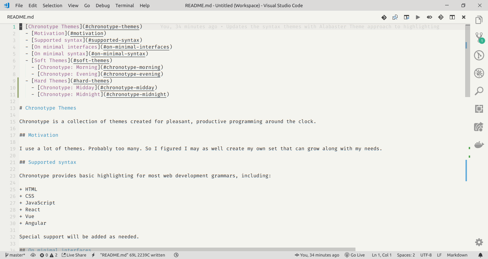

### Chronotype: Midnight

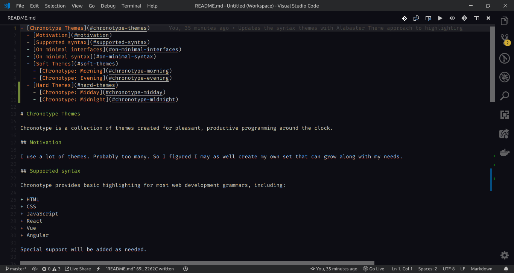

## Syntax Demo

### HTML

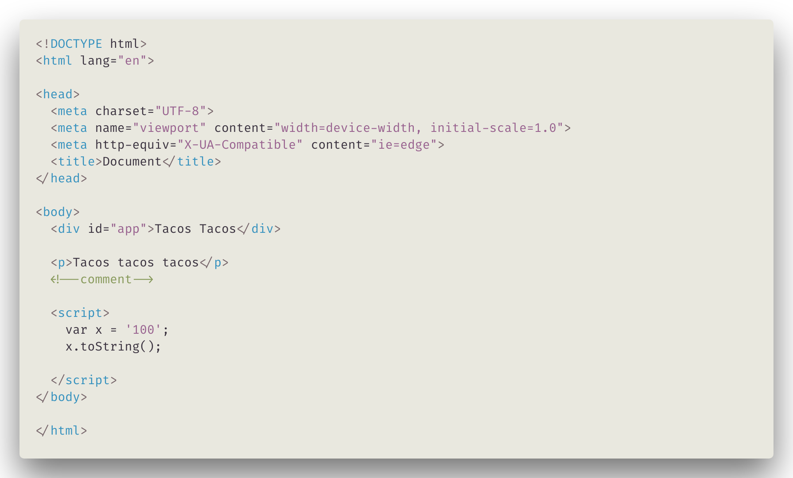
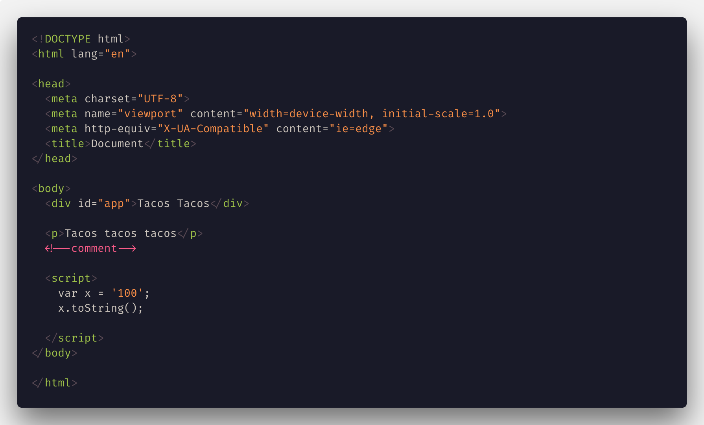

### CSS

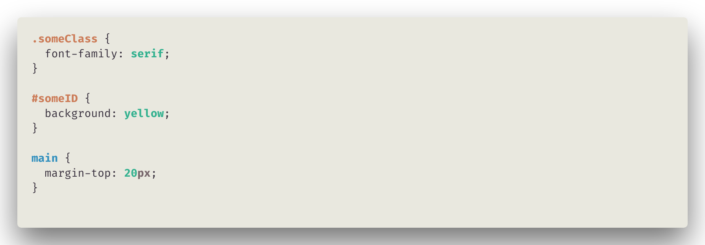
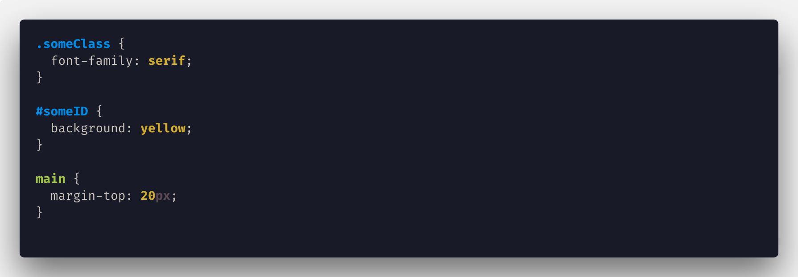

### JavaScript

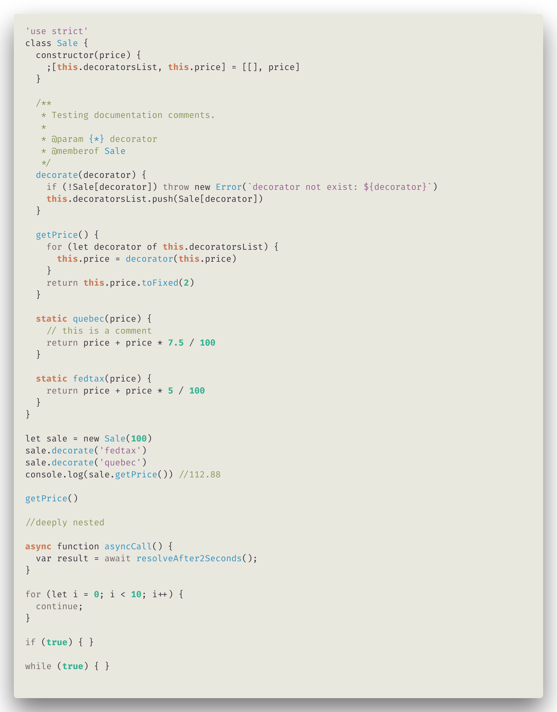
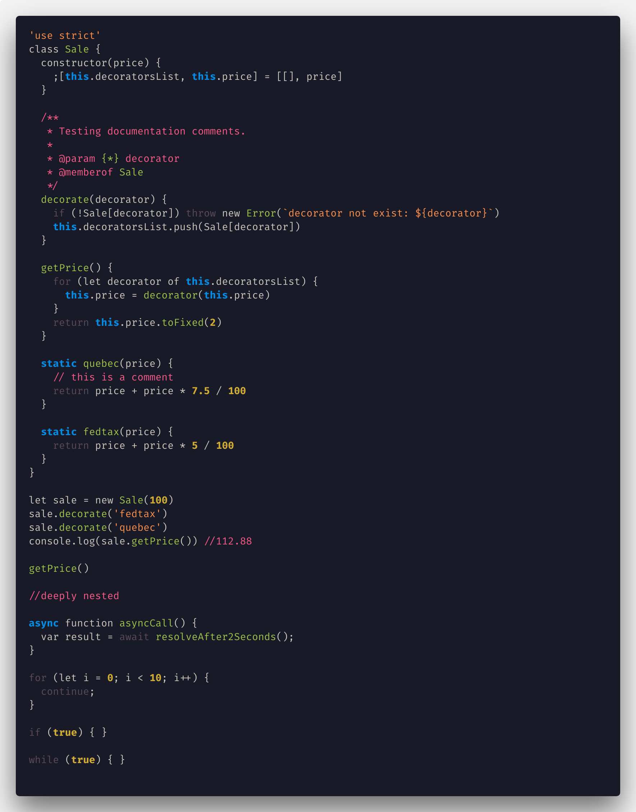

### React

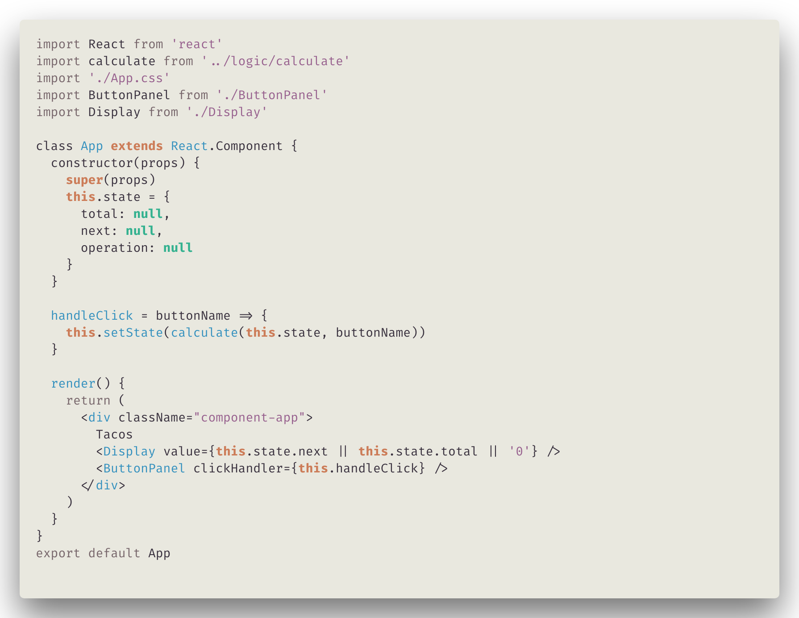
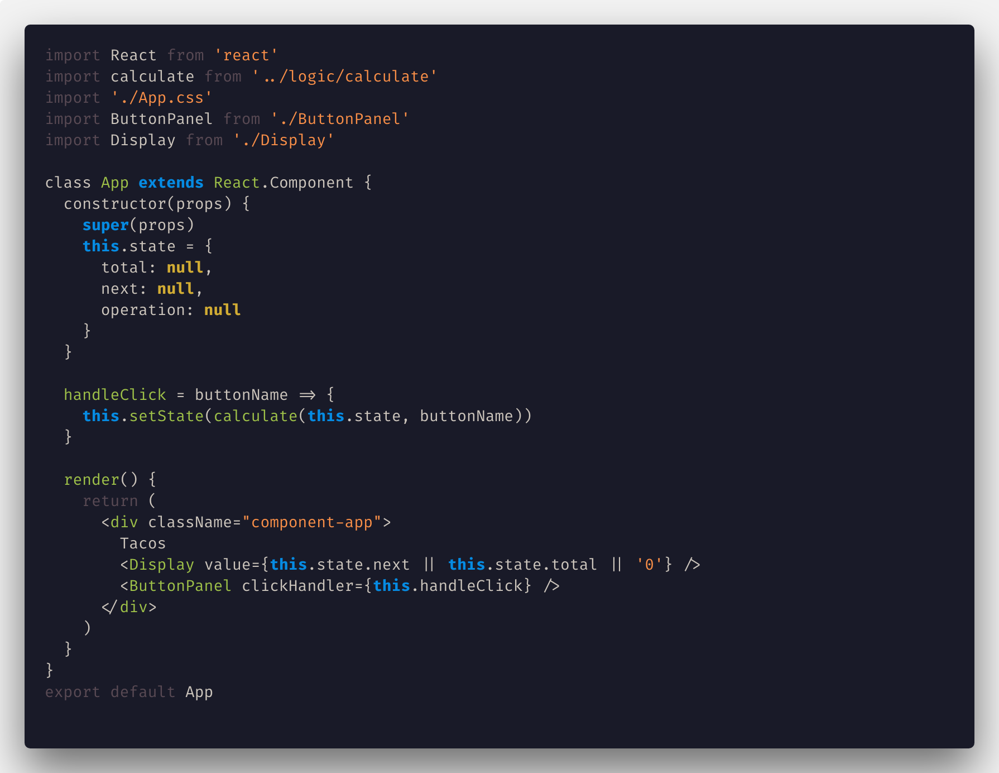

### Vue

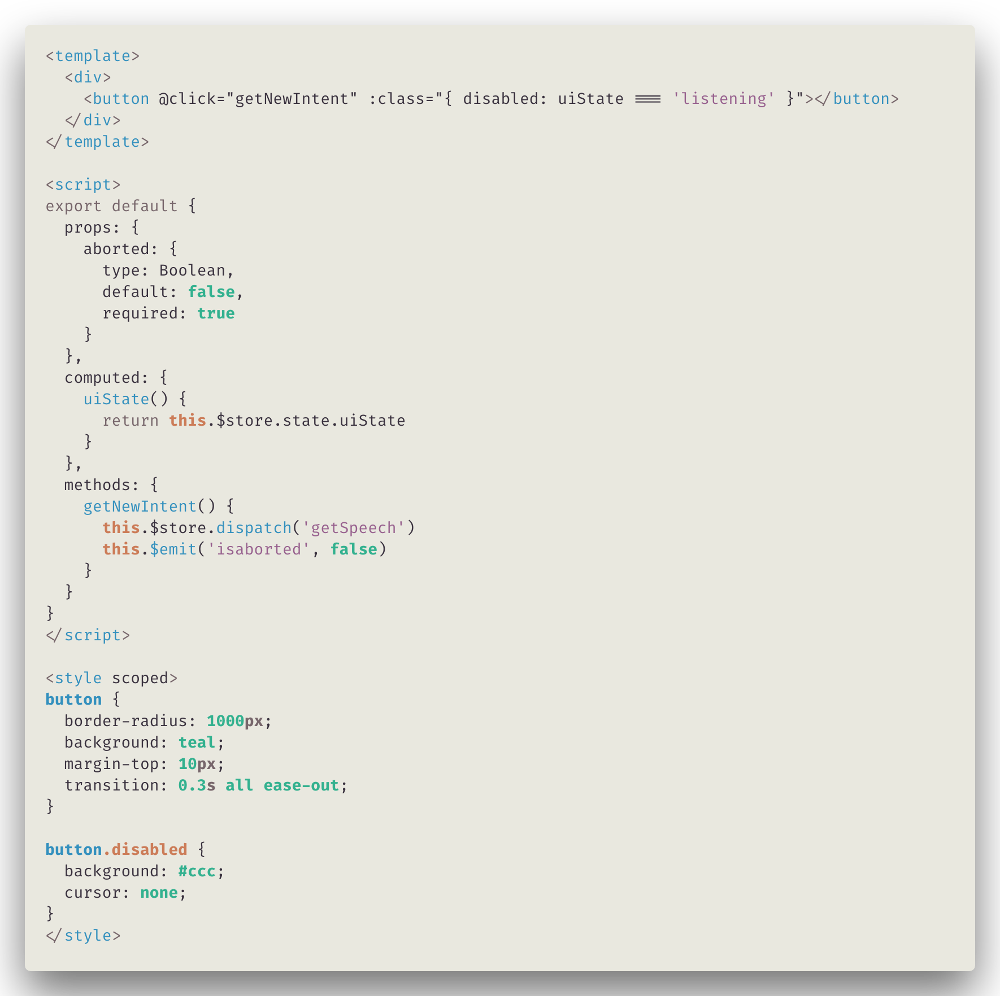
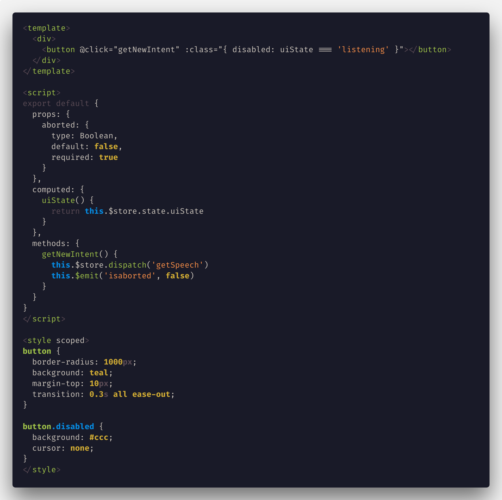

### Angular

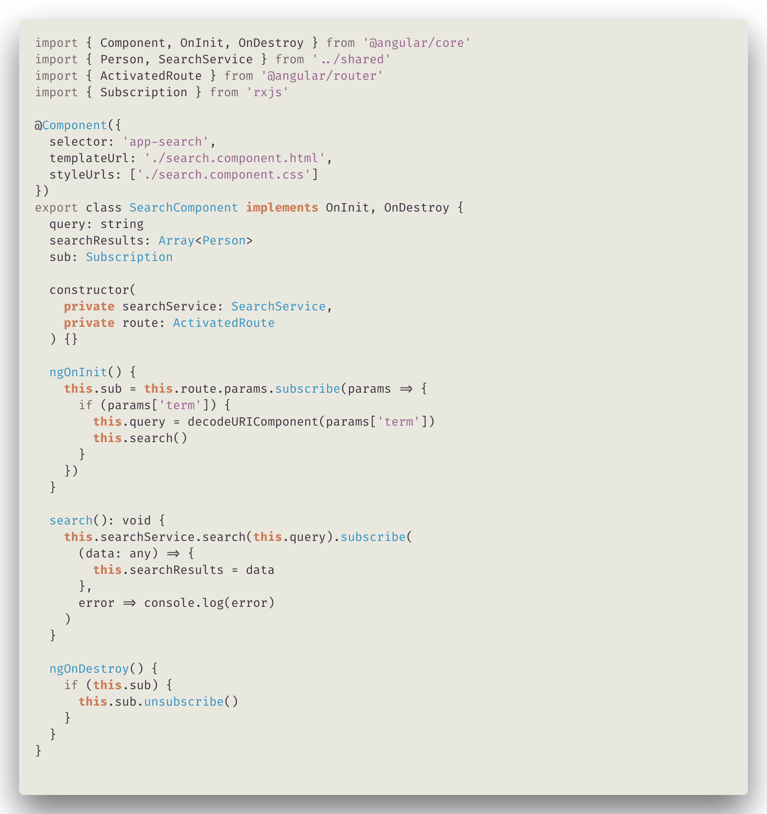
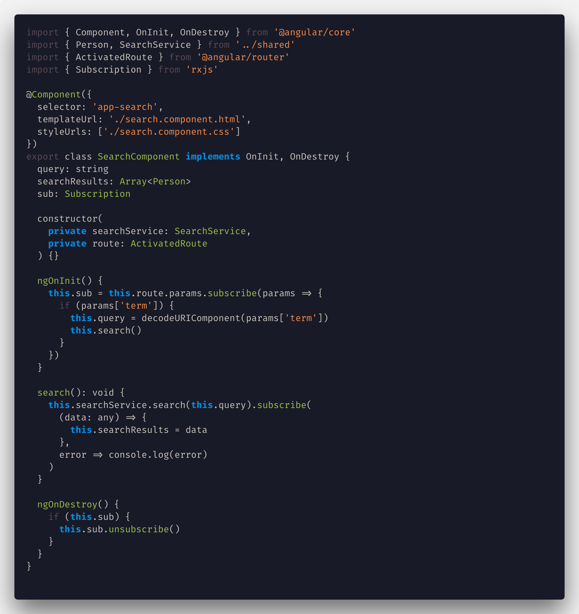
