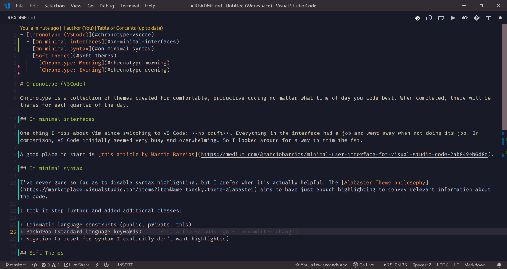

- [Chronotype (VSCode)](#chronotype-vscode)
  - [Soft Themes](#soft-themes)
    - [Chronotype: Morning](#chronotype-morning)
      - [HTML](#html)
      - [CSS](#css)
      - [JavaScript](#javascript)
      - [React](#react)
      - [Vue](#vue)
      - [Angular](#angular)
      - [PHP](#php)
      - [Ruby](#ruby)
    - [Chronotype: Evening](#chronotype-evening)
      - [HTML](#html-1)
      - [CSS](#css-1)
      - [JS](#js)
      - [React](#react-1)
      - [Vue](#vue-1)
      - [Angular](#angular-1)
      - [PHP](#php-1)
      - [Ruby](#ruby-1)

# Chronotype (VSCode)

Chronotype is a collection of themes created for comfortable, productive coding no matter what time of day you code best. When completed, there will be themes for each quarter of the day.

Enjoy :grin:

## Soft Themes

### Chronotype: Morning

#### HTML

#### CSS

#### JavaScript

#### React

#### Vue

#### Angular

#### PHP

#### Ruby

### Chronotype: Evening

#### HTML

#### CSS

#### JS

#### React

#### Vue

#### Angular

#### PHP

#### Ruby

