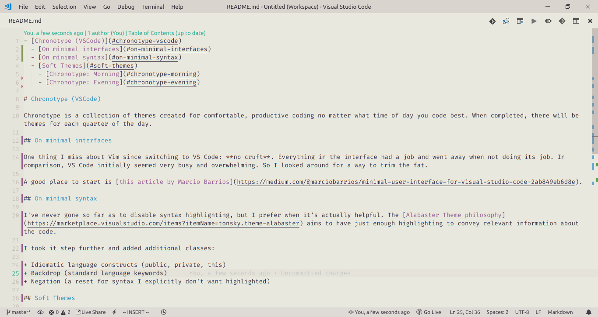

# Chronotype (VSCode)

Chronotype is a collection of themes created for comfortable, productive coding sessions no matter what time of day that happens to be. When completed, there will be themes for each quarter of the day.

I originally created it as an experiment, but I realized I was getting a little a obsessive about themes. So I figured the time was ripe to create my own.

Enjoy :grin:

## Chronotype: Morning

### Features

- Soft background to ease eyes into the task
- Slightly muted accents
- Covers many filetypes common for full-stack web development

### The UI

### A short list of grammars

#### HTML

#### CSS

#### JavaScript

#### TypeScript

#### React

#### Vue

#### PHP

#### Ruby
